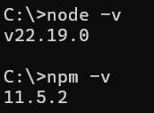
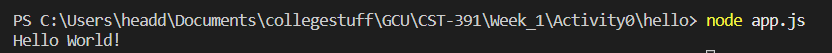
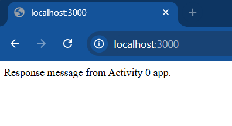
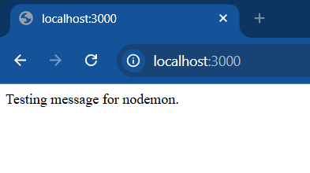
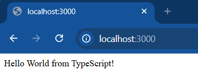
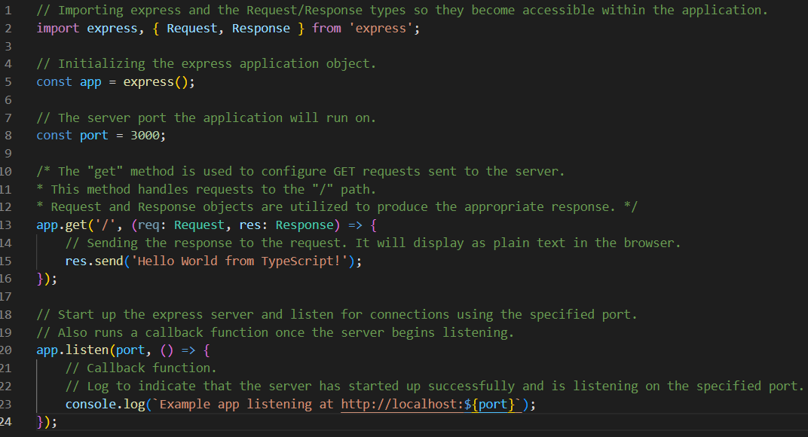

# Activity 0
- Author: Danielle DeSilvio
- Date: 5 September, 2025

## Introduction

- This activity will install the tools required to build Express applications and demonstrate how they run. Three examples will be showcased.
     - [NodeJS](https://nodejs.org/en): JavaScript-based runtime environment to develop web apps.
     - [Express](https://expressjs.com/): JavaScript-based framework used to run web servers.
     - [Visual Studio Code](https://code.visualstudio.com/): IDE used develop, run and debug.
     - [TypeScript](https://www.typescriptlang.org/): Adds static typing to JavaScript.

### Part 1

#### **Node and npm Versions**



NodeJS and NPM versions, displayed in the Windows terminal.

#### **NodeJS "Hello World" Application**



Running the NodeJS application in the Visual Studio Code terminal.

To run:

```
node app.js
```

#### **Express "Hello World" Application**



The Express application’s response, as seen in the browser.

To run:

```
node app.js
```

#### **Express "Hello World" Application with Nodemon**



The changed response string displayed in the browser after nodemon restarted the application.

To run:

```
nodemon app.js
```

### Part 2

#### **TypeScript "Hello World" Application**



The TypeScript application running, with the server response as seen in the browser.

This is run with a custom start script. To run, enter in the terminal:

```
run npm start
```

#### **Commented TypeScript Code**



The commented TypeScript code.