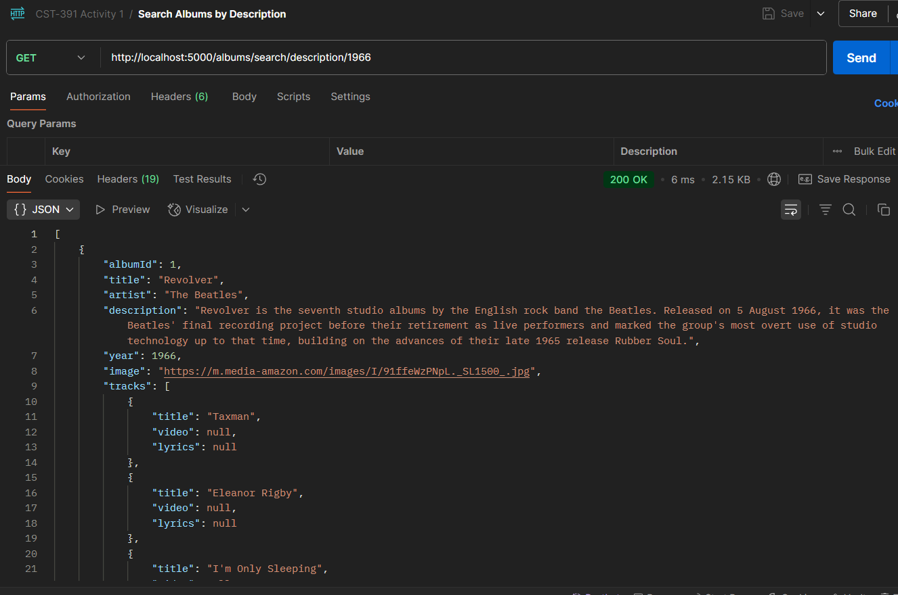

# Activity 1
- Author: Danielle DeSilvio
- Date: 10 September, 2025

## Introduction

- This activity demonstrates a RESTful API running on an Express server via NodeJS. The architecture showcased here will be used in the development of full-fledged Angular and React applications.
     - [MySQL](https://www.mysql.com/): the database technology used
     - [MAMP](https://www.mamp.info/en/): used to run the database server as demonstration for this activity
     - [Postman](https://www.postman.com/): Used to test the functionality of API endpoints.

- Links for server and development technology:

     - [NodeJS](https://nodejs.org/en)
     - [Express](https://expressjs.com/)
     - [TypeScript](https://www.typescriptlang.org/)
     - [Visual Studio Code](https://code.visualstudio.com/)

The application is run with a custom start script. To run, enter in the terminal:

```
npm run start
```

## Video Demonstration

Click the link below to view the demo of the API being tested in Postman.

[]()

### **All Albums**


Performing the API Call to get all albums.

Request made to:

```
http://localhost:5000/albums
```

### All Albums by specified artist.


Getting all albums by a specific artist using a search query in the url.

Request made to:

```
http://localhost:5000/albums/The%20Beatles
```

### Getting Album by its ID


Getting a single album by using its ID in the url.

Request made to:

```
http://localhost:5000/albums?albumId=7
```

### Searching Albums by Artist


Searching all albums by artists. The artists of the results contain the search term in the url.

Request made to:

```
http://localhost:5000/albums/search/artist/Beat
```

### Searching by Album Description



Searching all albums by their descriptions. The descriptions of the results contain the search term in the url.

This is run with a custom start script. To run, enter in the terminal:

Request made to:

```
http://localhost:5000/albums/search/description/1966
```

### New Album


Creating a new album by sending a POST request with JSON data object.

 listed in the albums table, displayed in phpMyAdmin.")

The new album (ID no. 14) listed in the albums table, displayed in phpMyAdmin.

Request made to:

```
http://localhost:5000/albums
```

[JSON data used in the request (Click)](./json/create_album.json) 

### Update Album


Updating an album by sending a PUT request with JSON data object.

 listed in the albums table, displayed in phpMyAdmin.")

The updated album (ID no. 5) listed in the albums table, displayed in phpMyAdmin.

Request made to:

```
http://localhost:5000/albums
```

[JSON data used in the request (Click)](./json/update_album.json) 

### Delete Album


Deleting an album by sending a DELETE request with the album's ID in the url.

 was deleted, displayed in phpMyAdmin.")

The table in the database after the album (ID no. 3) was deleted, displayed in phpMyAdmin.

Request made to: 
 
```
http://localhost:5000/albums
```

## Conclusion

This activity showcased a RESTful API being run on an Express server, utilizing NodeJS and MySQL. The following endpoints of the API were demonstrated:

- Getting all albums
- Getting all albums by a specific artist
- Searching albums by artist
- Searching albums by description
- Getting a single album by its ID
- Creating albums
- Updating albums
- Deleting albums
- Getting all artists

While results were showcase with Postman, the API can be accessed in other contexts, like web applications, to interact with the database. The API will use user inputs within prepared SQL statements - by way of parameters - to perform CRUD operations.