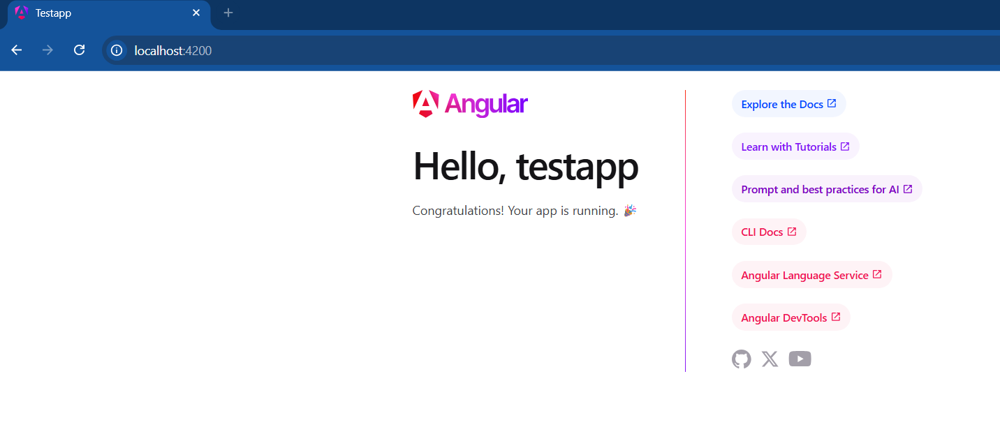

# Activity 2
- Author: Danielle DeSilvio
- Date: 15 September, 2025

## Introduction

- This activity demonstrates the installation of Angular, in addition to setting up a new test application using it. 
     - [Angular](https://www.mysql.com/): The  web framework installed and demonstrated in this activity; used to build web applications.

- Links for server and development technology:

     - [NodeJS](https://nodejs.org/en)
     - [Express](https://expressjs.com/)
     - [TypeScript](https://www.typescriptlang.org/)
     - [Visual Studio Code](https://code.visualstudio.com/)

The application is run with a custom start script. To run, enter in the terminal:

```
ng serve -o
```

### Angular Version


Viewing the version of Angular in Visual Studio Code's console after it is installed.

### Running the Angular Project



Running the newly created Angular project for the first time.

### Using a Custom Title


Displaying a different "title" parameter on the home page of the application. This was done by simply replacing the parameter; no changes were made on the front end code.

### Using Another variable


My name is assigned to a variable named "message", which, when utilized within the template, is displayed on the home page.

## Research

### Project Structure

- **node_modules folder**
     - This folder contains the external NodeJS modules (in this case, Angular, Typescript, etc.) that the application requires to function. Modules will, by default, be installed in this folder since it is the path NodeJS uses to locate them.
     
          This folder usually ends up being very large, so it is ignored using .gitignore; it will not be uploaded to the repository this way, saving storage space and preventing large downloads when it is cloned.

          When cloned, these modules can be reinstalled with npm, which will retrieve the list of needed modules via the "dependencies" and "devdependencies" arrays in package.json.

- **src folder**
     - Short for "source", this is the subfolder that contains the applications assets, source code and configuration files. It is kept at the root level of the project.

- **src/app folder**
     - The folder that contains the main application logic, templates, styles and data.


**Note that the following folders are not included with this project.**

- **src/assets folder**
     - Contains static assets utilized by the application, such as images and fonts.

          **Note: this folder is not included within this repository; in Angular version 18, it has been replaced by the "public" folder located at the root level.**

- **src/environments folder**
     - Contains the environment configuration files. They contain different values (API URLs for example) that will differ between development and production environments. Utilizing them will ensure proper testing during development.

          **Note: this folder is not included within this repository.**

- **angular.json file**
     - Contains Angular-specific configuration, such as the root location, builders, target files, and client options.

- **package.json file**
     - Contains NodeJS configurations, including the starting scripts, project dependencies, license and version number.

- **tsconfig.json file**
     - Contains TypeScript-specific configurations such as compilation behavior, type safety, and output folder.

### Page Files

- **main.ts**
     - Entry point of the application. Referencing the application's configuration files, the application starts up via this file.

- **app.component.css (app.css in this project)** 
     - The css stylesheet for the app.

- **app.component.html (app.html in this project)** 
     - The default html template that serves as the application's home page.

- **app.component.ts (app.ts in this project)**
     - Where the app's root component is defined and its templates, styles and imports are set. The App class is defined here as well, and in this project it defines variables that are used on the home page.

- **app.module.ts**
     - The root module which contains specific instructions for compilation.

          **Note that this file is not included in this project: from Angular version 17 and onward, project components can be standalone, eliminating the need for this file.**

## Conclusion

This activity demonstrated the installation of Angular and the setup of a new test project. How custom variables are integrated into the front end template was also showcased.

The files that are used to configure and build the application were additionally showcased and explained in depth.