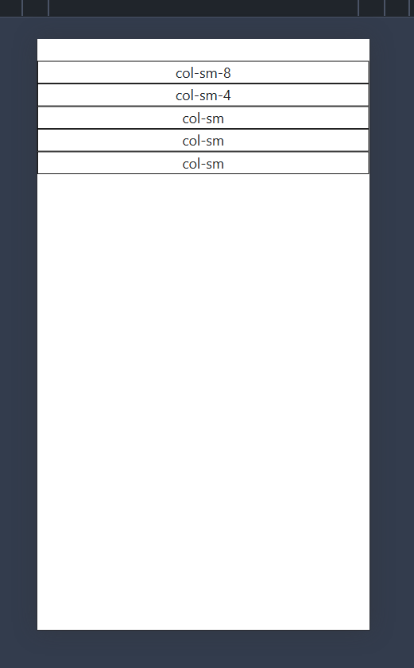
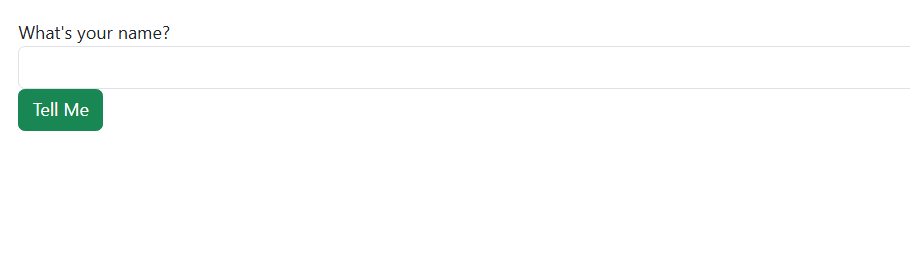
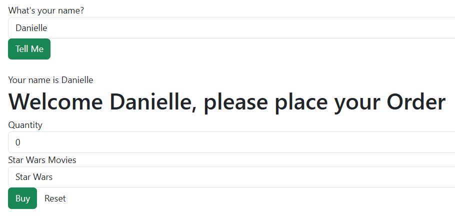
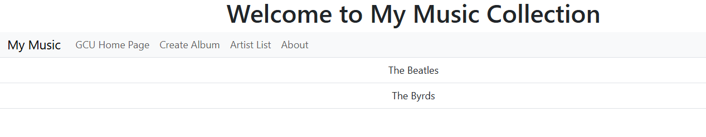
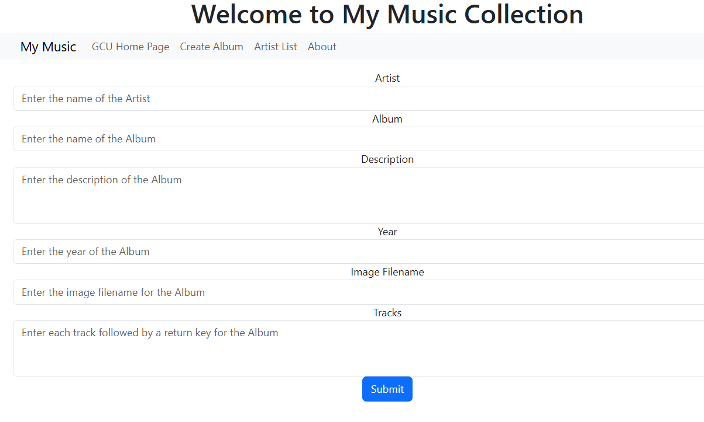
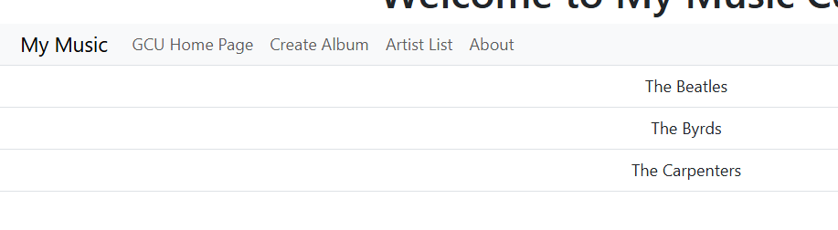
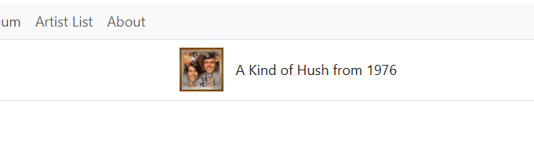
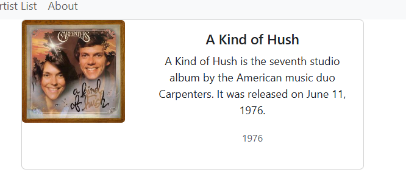

# Activity 3
- Author: Danielle DeSilvio
- Date: 27 September, 2025

## Introduction

- This activity demonstrates various aspects of Angular that are used in development, such as Components, Routes, and Events. 
     - [Angular](https://angular.dev/)

- Links for server and development technology:

     - [NodeJS](https://nodejs.org/en)
     - [Express](https://expressjs.com/)
     - [TypeScript](https://www.typescriptlang.org/)
     - [Visual Studio Code](https://code.visualstudio.com/)

The application is run with a custom start script. To run, enter in the terminal:

```
ng serve -o
```

## Part 1 - Angular Components, Events, Routes, and Data Binding

")

The responsive table grid, viewed on a larger viewport. (Note that borders have been added for visibility.)



Viewing the responsive table grid on a smaller viewport.



The initial shop form before entering a name.



The shop form after entering a name. The application takes the input and uses it in its elements.


The console in the developer tools, after making a selection in the shop form and clicking the "Buy" button. The selection and quantity are displayed in the logged message.

### Research - Part 1

**@Input()** in *info.ts*: A decorator used on class property to denote them as an input properties. This is utilized by other components (The shop, in this case) to bind the input value using the user input it has received.

**[value]** in *info.html*: A property binding flag which assigns values to attributes - in this case the "value" attribute of the element. The attribute value is associated with a variable in the "info" class.

**[(ngModel)]** in *info.html*: A two-way binding property. ngModel in this case denotes that the form it is attached to will synchronize inputs and selections with the chosen variable.

## Part 2 - Music Application Frontend



The main page with the initial artist list open.



The album creation form.



The artist list after another addition was made.



Selecting the new artist, which brings up the list of albums. Only one was added, so that is all that is displayed here.



Selecting the new album brings up its info.


The version number, as displayed by an alert when "About" is clicked.

### Research - Part 2

The following code block is the contents of music-service.ts with full comments.

```js
import { Injectable } from '@angular/core';
import exampledata from '../../data/sample-music-data.json';
import { Artist } from '../models/artists.model';
import { Album } from '../models/albums.model';


// Marks this service as an injectable dependency.
// It will be initialized automatically when imported as such in other components
@Injectable({ providedIn: 'root' })
export class MusicService {

  albums: Album[] = exampledata;

  // Retrieves a list of all artists in the data set.
  public getArtists(): Artist[] {
    let artists: Artist[] = [];
    let artistSet = new Set<string>();

    // First add albums to the Set which ensures unique entries
    this.albums.forEach(a => artistSet.add(a.artist));

    // Then add the artists to the array to return them
    artistSet.forEach(a => artists.push({artist: a}))
    return artists;
  }

  // Retrieves a list of all albums in the data set.
  public getAlbums(): Album[] {
    // Return the list of Albums
    return this.albums;
  }

  // Retrieves a list of all albums by a specific artist.
  public getAlbumsOfArtist(artistName: String): Album[] {

    let albums: Album[] = [];

    // Loop through the albums find matches with the album's artist property
    this.albums.forEach(album => {
      if (album.artist == artistName) {
        // Add matches to the results array
        albums.push(album);
      }
    });
    return albums;

  }

  // Creates and adds a new album to the data set
  public createAlbum(album: Album): number {
    // Add a new Album to the list of Albums
    this.albums.push(album);
    return 1;
  }

  // Updates an existing album
  public updateAlbum(album: Album): number {
    // Search for the Album in the list of Albums and replace it in the list
    for (let i = 0; i < this.albums.length; ++i) {
      if (this.albums[i].albumId == album.albumId) {
        this.albums.splice(i, 1, album);
        return 0;
      }
    }
    return -1;
  }

  // Deletes an album using its id
  public deleteAlbum(id: number): number {
    // Search for the Album in the list of Albums and delete from the list
    for (let i = 0; i < this.albums.length; ++i) {
      if (this.albums[i].albumId == id) {
        this.albums.splice(i, 1);
        return 0;
      }
    }
    // Return -1 if deletion was not successful
    return -1;
  }
}
```

## Conclusion

This activity demonstrated the development of a frontend application using Angular components. This includes aspects such as data binding, routes, and events. Data binding in particular is crucial to the function of websites, as it syncs data between the view and the component. This allows for the component to quickly interact with important data such as user inputs.

Responsive elements were highlighted, showing how websites built on Angular can respond to different screen sizes.