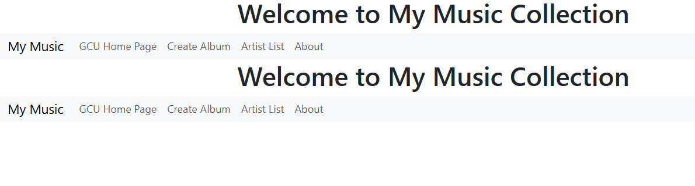
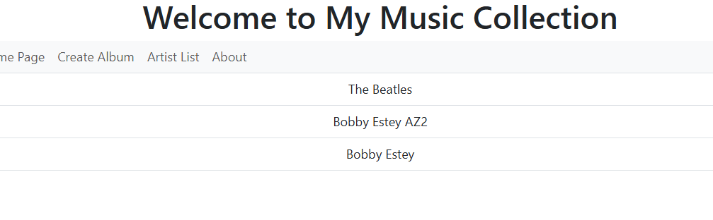
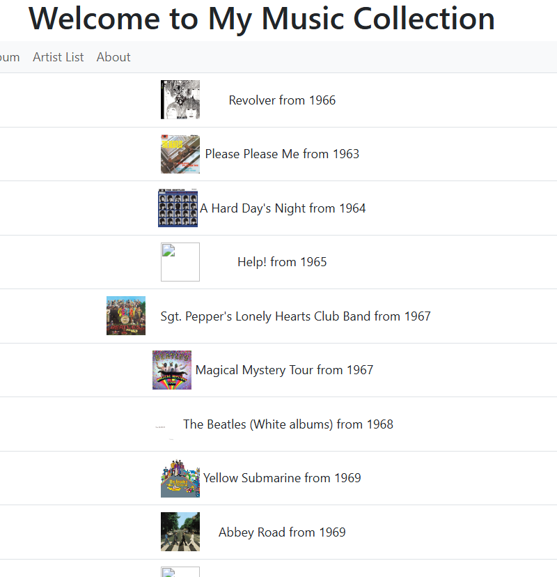
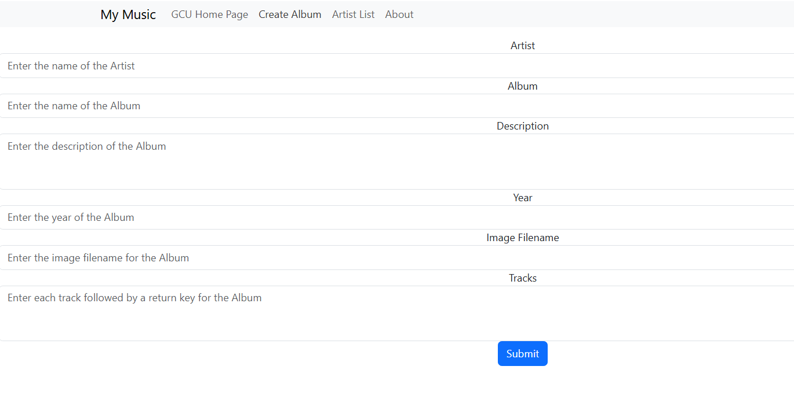

# Activity 4
- Author: Danielle DeSilvio
- Date: 1 October, 2025

## Introduction

- This activity demonstrates the integration of API communication into an Angular app. The Music App from previous activities in particular is expanded upon. 

- Links for server and development technology:
     - [Angular](https://angular.dev/)
     - [NodeJS](https://nodejs.org/en)
     - [Express](https://expressjs.com/)
     - [TypeScript](https://www.typescriptlang.org/)
     - [Visual Studio Code](https://code.visualstudio.com/)

The application is run with a custom start script. To run, enter in the terminal:

```
ng serve -o
```

## Application Screenshots



The main page.

The navBar displays twice since the main app component is called to be rendered on the homepage view, which is already done by default. However, removing this manual reference causes a routing error. I am still researching a solution for this.



The artist list, retrieved from the MySQL database.



The list of albums by a specific artist - The Beatles in this case.

")

Selecting an album brings up its details and tracks. (Track numbers are currently not displaying properly)



The album creation page. Entering details here, then clicking submit will create new album and track entries in the MySQL database.

## Research - How Angular manages states

Angular typically uses JSON Web Tokens (JWTs) to manage the user's logged in state. They are stored on the client side in the browser's storage.

JWTs are self-contained objects that contain info about the user's session. These are read by the application via HTTP request interception and verified server side to authenticate the user's request. Route guarding is also put in place to authenticate the requests; this ensures users are authenticated before giving them access to the pages that require such authentication.

## Conclusion

This activity demonstrated further development of the music application developed in previous activities, this activity in particular focusing on integrating with the MusicAPI that was developed previously. The API is included in this activity as such, and it must be run as a separate instance from this application for it to run properly.

The Angular application performs the appropriate calls to the API dependent on user action. In this case, only viewing and creating albums are fully functional as of now. Updating and deleting albums will be fully functional in the future.

How Angular manages logged-in states (using JWTs on the client side) was additionally explained in depth.