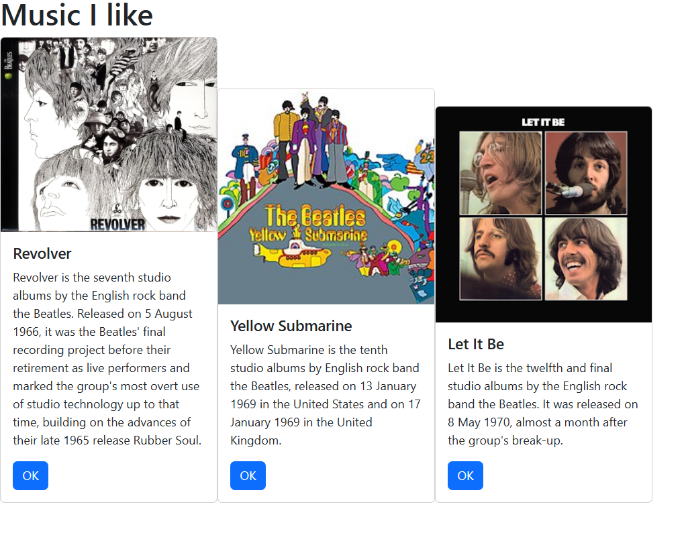
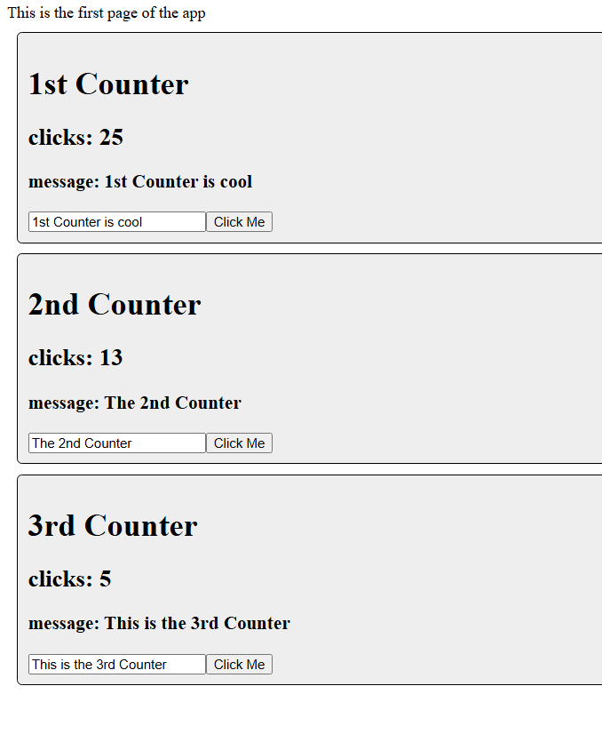
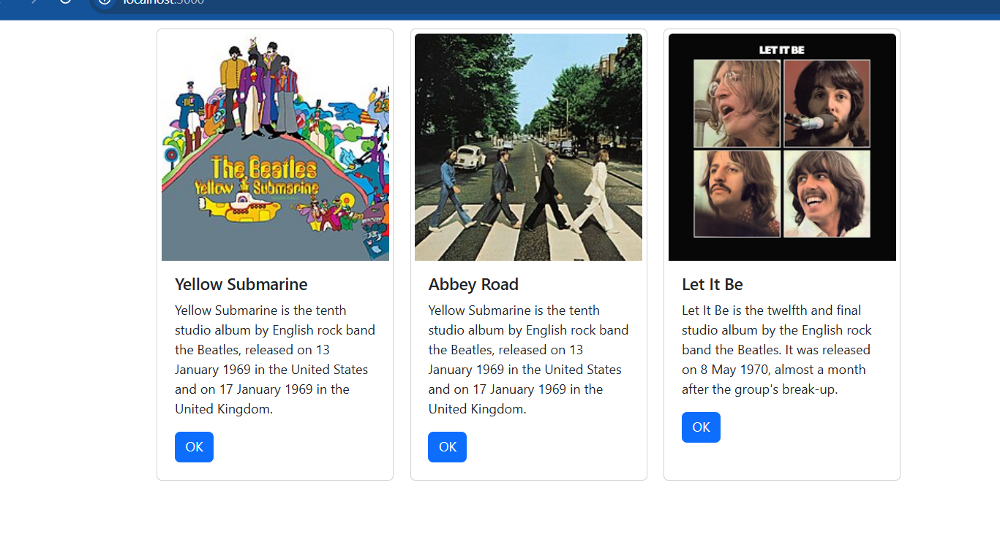

# Activity 5
- Author: Danielle DeSilvio
- Date: 10 October, 2025

## Introduction

- This activity introduces React, React components, JSX and other tools and concepts useful in web development. 

- Links for server and development technology:
     - [React](https://react.dev/)
     - [NodeJS](https://nodejs.org/en)
     - [Visual Studio Code](https://code.visualstudio.com/)

The application is run with a custom start script. To run, enter in the terminal:

```
npm run start
```
## Part 1

### Application Screenshots



The initial music app main page.

Note that for visibility for this screenshot, the "Card" component was given the style "display: inline-block".

The info displayed is taken from the database used for previous activities. Using them in input parameters on the main component displays them with proper formatting in the Card Components, which act like templates.



Three counter components with different values. This showcases how each component interacts with user inputs and actions. The "Click Me" button raises the clicks counter, while the textbox message is used by a header element in the component.

### New Featured Introduced

The application utilizes React components to render elements on pages. These components make use of JSX to read HTML directly from the code; parameters can be inserted into the HTML this way with curly braces ({}).

Properties are passed on from views that make use of the components; parameters are read from these properties to uniquely customize each component, which results in the custom Card elements seen above.

Similarly, the Counter components use properties as well that change based on how the user interacts with certain elements. This is configured by the useState function which provides the parameters to use based on a given data type.

## Part 2

### Application Screenshots



The music app, with the Card components aligned by CSS flexbox.

Data used is from the code provided in the activity instructions. This time the info is mapped to the elements from a hard-coded array.

### New Features and Terminology

While configured to use states (which have been outlined before) to modify albums, the ability to do as such has not yet been implemented in the music application. The application now instead accessed a preset array, and, using JavaScript's built-in mapping function, assigns each property to a Card element. The function does this for each album and eliminates the need to manually assign data to the component's properties.

Flexbox has also been implemented to format the card elements, making them more presentable.

## Conclusion

This activity introduced React and how it is used to build web applications. This includes components, how JSX is utilized to build components with HTML, and how states are used to create interactive elements.

Other useful web development concepts were also covered, such as JavaScript's mapping function which processes array items in a few lines of code, removing the need for manual configuration.