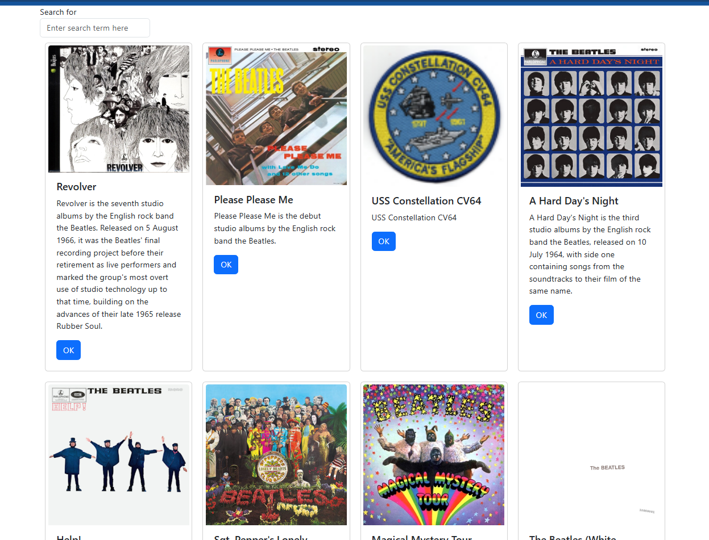
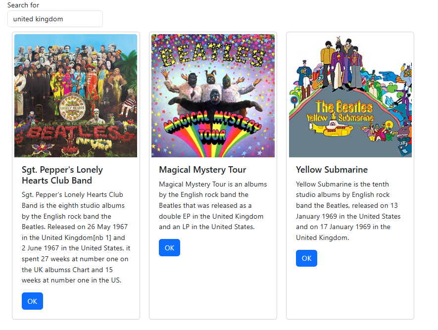
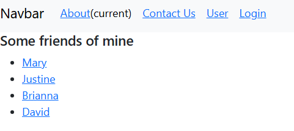
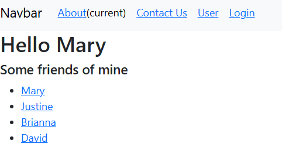
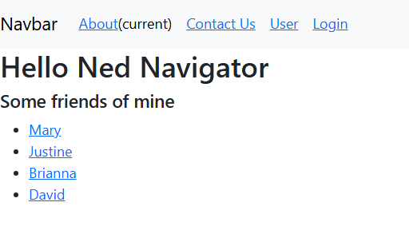
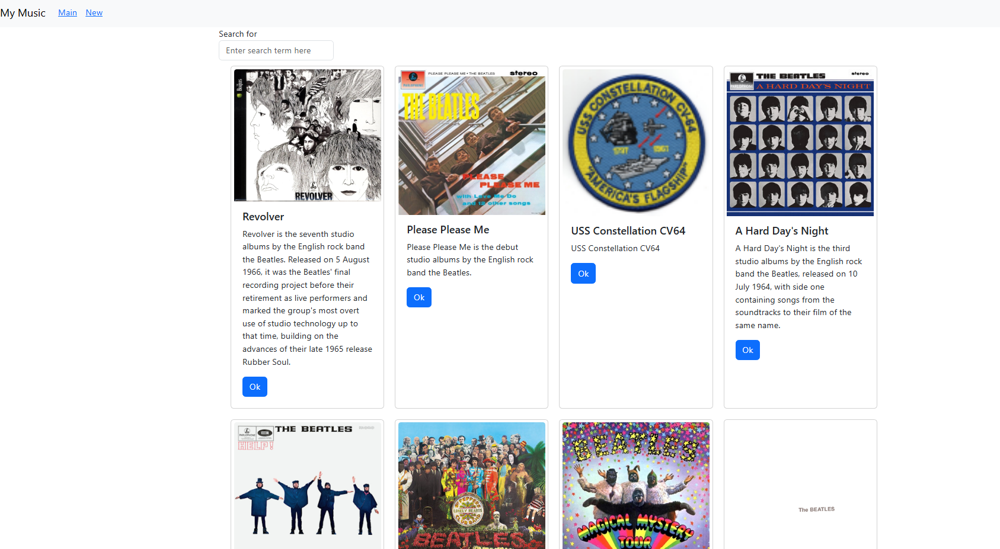
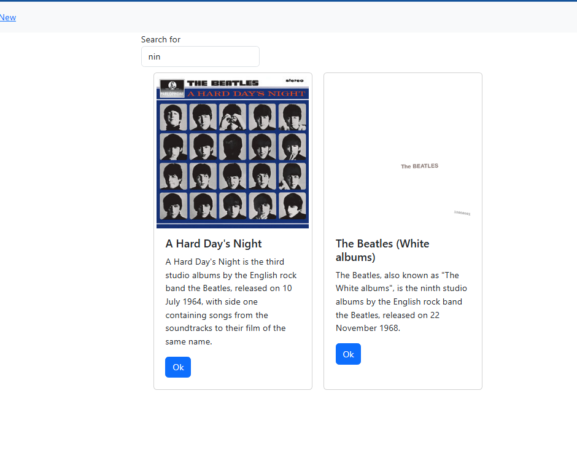

# Activity 6
- Author: Danielle DeSilvio
- Date: 13 October, 2025

## Introduction

- This activity delves deeper into React development, expanding on features such as states, hooks, and asynchronous functions. API integrtion is introduced as well, providing the music application developed in the previous activity to interface with the music database used in other activities.

- Links for server and development technology:
     - [React](https://react.dev/)
     - [NodeJS](https://nodejs.org/en)
     - [Visual Studio Code](https://code.visualstudio.com/)

The applications in this activity are run with a custom start script. To run them, enter in the terminal:

```
npm run start
```

**Note: this activity is considered to be a continuation of Activity 5, which ended on Part 2. So, this application begins with Part 3.**

## Part 3

### Application Screenshots - Music App



The initial music app main page. Interaction with the API has been added to the application, allowing it to pull the data for albums from the MySQL database.



Performing a search on the albums.

This search function specifically searches the album's descriptions and does not perform any calls to the API to do so--instead searching using variables (stored data) and state functions to get results and update the page.

### New Features Introduced - Music App

Integration with the API was implemented. Currently it only retrieves the albums on page initialization. It makes use of asynchronous functions to perform the API call so that the application can run without waiting on a response.

Searching can be performed on the home page with data already retrieved from the database. The search itself is performed with state functions in order to find results and update the page.

### Application Screenshots - Routing App



The home page of the routing application, which will demonstrate navigation between components which will act as pages. Links to different "profiles" are displayed.



Clicking on a profile link will display the profile name in a header element. This is done with parameters.


Certain pages will require the user to be "logged in", such as the About and Contact page in this case.

Logging in is not fully implemented, and is rather handled by states.


After "logging in", users can view the About page.


The contact page, which also requires a "logged in" state.



The user page, which displays the user's name in a header element.

### New Features Introduced - Routing App

The routing app introduced routing, which is used in React to seamlessly navigate between the components which are used as user-facing pages. States and parameters and how they both are utilized to manage interactive elements on pages are also demonstrated. States in particular are shown to demonstrate a faux "logged in" state which is checked to forbid or allow access to certain components.

## Part 4

### Application Screenshots



The music app home page. The main difference is the addition of a bootstrap NavBar.



Performing a search, which functions the same as before.


The "New" link in the NavBar leads to a placeholder component. A form for creating new albums will be developed in Activity 7.

### New Features Introduced

The addition of a Bootstrap NavBar is the sole visual change.

The main changes are related to how the components are organized and rendered; many additional components were added to organize the main app component. The components operate on a hierarchical level to render each other--the albums are a collection of Card components rendered by a single albumList component, for example.

Routes were also implemented for seamless page navigation.

## Conclusion

This activity demonstrated additional features of React and how they are used to develop web applications. States and routes were the main focus to demonstrate navigation and data transfer between pages. How this plays into user interactivity is also demonstrated--forbidding access unless users are logged in, for example.

Integration with the API used in previous activities was also demonstrated.