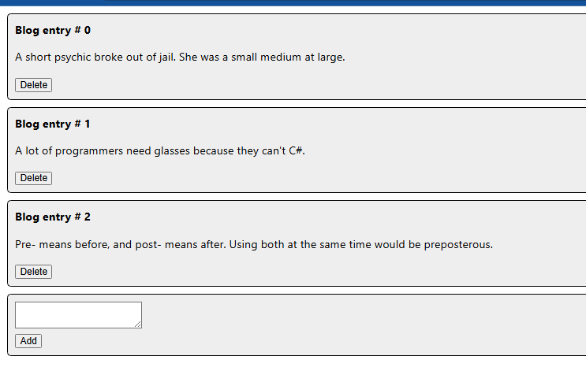
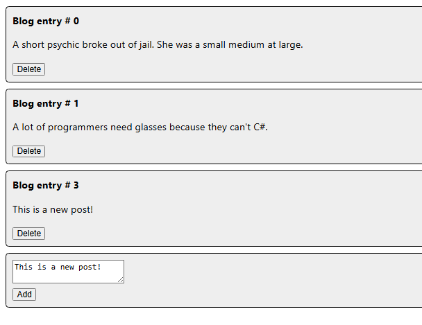

# Activity 7
- Author: Danielle DeSilvio
- Date: 18 October, 2025

## Introduction

- This activity further showcases web application development using React, demonstrating the implementation of dynamic and interactive components within the music application covered in previous activities. New features add further interactivity with the API to the application.

- Links for server and development technology:
     - [React](https://react.dev/)
     - [NodeJS](https://nodejs.org/en)
     - [Visual Studio Code](https://code.visualstudio.com/)

The applications in this activity are run with a custom start script. To run them, enter in the terminal:

```
npm run start
```

**Note: this activity is considered to be a continuation of Activity 6, which ended on Part 4. So, this application begins with Part 5.**

## Part 5

### Application Screenshots - Blog App



The main page of the blog app. Entries are individual components; though changes performed are purely visual and do not interface with an API.



Adding and deleting a blog post.

Entry #2 was deleted, and entry #3 is created using the content of the textarea below the entries. This is done by syncing the components with an array on the main parent component.

### New Features Introduced - Blog App

Dynamic components that change in response to user action were introduced. This is done with states that sync a local array with page content - a component for each blog entry, in this case.

Changes are displayed on the page after they are made, since React re-renders components after changes are made to variables handled by states.

### Application Screenshots - Music App


The new album creation form.

Filling out the form and clicking "Submit" will add a new Album object to the database.

### New Features Introduced - Music App

The ability to add new albums to the database (done through the API) was added to the music app. Once users fill out the required form, the app will create an album object which is sent in a request to the API. The API maps the album's data to a SQL query to insert it into the database.

## Part 4

### Application Screenshots - Music App
 


The main page of the music app, with new "Edit" buttons on each individual album card. Clicking these will bring users to the associated edit form for the album.


The album edit form.

Once all the fields are filled out, the application will apply the data to the album the user specified to edit on the home page.

### New Features Introduced - Music App

The ability to edit albums was introduced.

Users will select an album to edit by pressing the associated "Edit" button on the home page where all of the albums are listed. The application will keep track of the album the user wants to edit, and once all forms are filled out, the application will send the data in a request to the API. The API will map the data to a SQL query to apply the changes in the database.

## Conclusion

This activity introduced dynamic React components that changed website structure in response to user actions. Using states and hooks, React will detect changes to variables and data that components use and re-render the components accordingly, displaying the changes to the user without needing to refresh.

Additionally, the ability to add and edit album objects was added to the music application covered in previous activities.