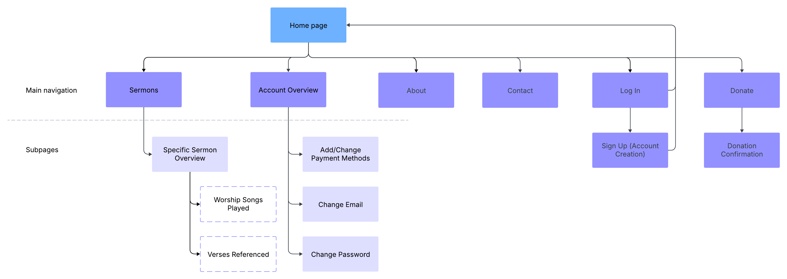
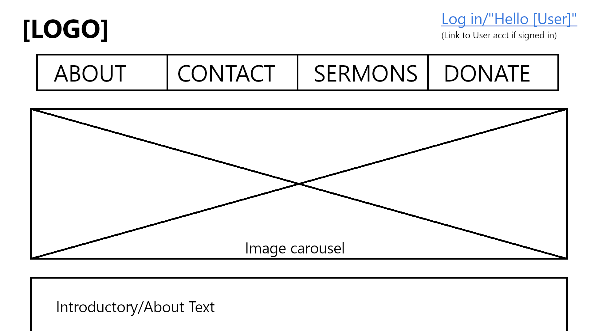
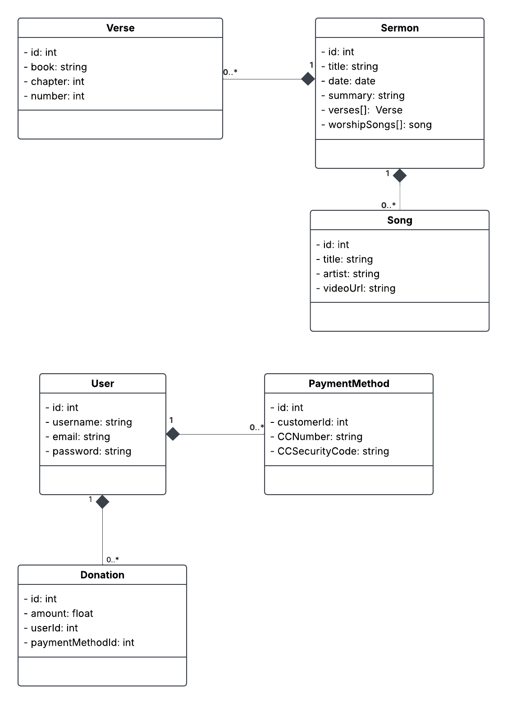

# CST-391 Milestone 1 - Project Proposal

**Eastern Ridge Church App**

- Author: Danielle DeSilvio
- Date: September 13, 2025

## Introduction

The Eastern Ridge Church is a hypothetical church aiming to provide its members a means of accessing the topical content and resources found within their sermons. Users of the application will be able to see sermon summaries, verses referenced, and the songs used in the worship service.

Members will additionally be able to send messages to church faculty and make donations through the app.

## User Stories

| User Functionality | Admin Functionality |
| -------- | ------- |
| Create an account  | Create Sermons    |
| Log in             | Edit Sermons      |
| View Sermons       | Delete Sermons    |
| View the verses and songs associated with sermons | View messages sent by users through the contact form
| Send messages through a contact form | |
| Make a donation |                      |
| Change username, email and password |  |
| Add, Change, and delete payment methods | |

## Database ER Diagram

ER Diagram for the church app.

## Sitemap

## UI Wireframes

The home/about page. This page will be scrollable to accommodate both the carousel and the introductory text.

Contact form.

Sermons list.

Sermon page.

Donation form.

Log in form.

Sign up form.

## UML

UML Class Diagram.

## Risks

Time management is the most notable, if the only, concern that would be involved in this project. To a degree, this has been mitigated by the fact that it is a fairly small project that will not need much setup, especially in regards to data management.

It will, however, still require a great amount of time to realize, even during its prototyping stages - something that can be difficult to find and dedicate for a student with an unpredictable schedule such as myself. How this will be handled will be evaluated in the coming weeks.