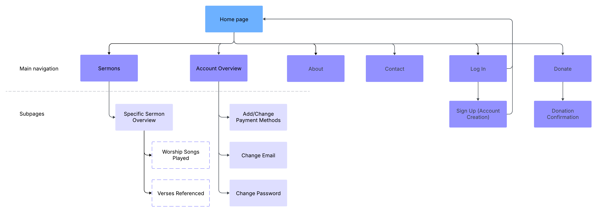
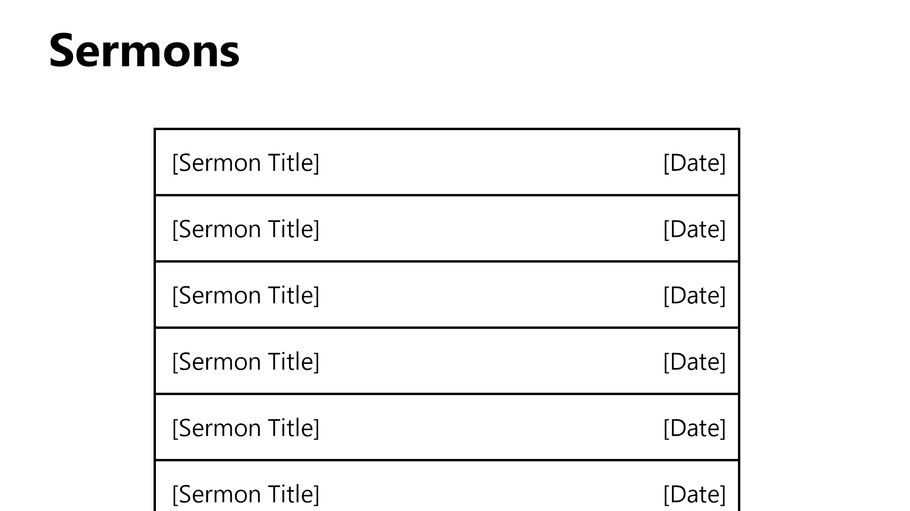
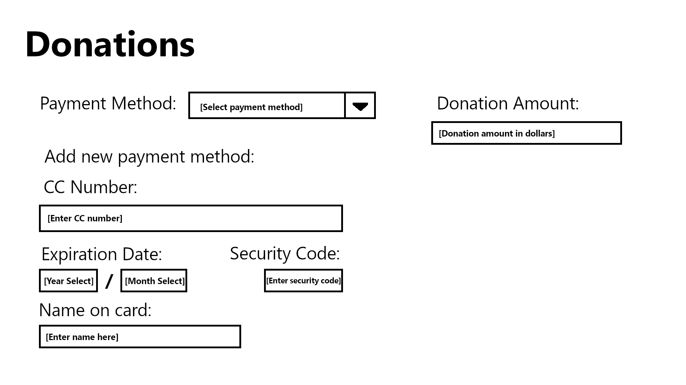
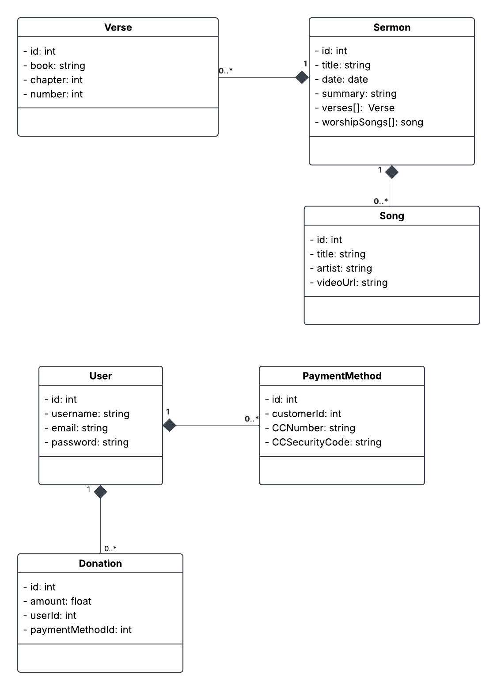

# CST-391 Milestone 4 - Rest API using Express Framework

**Eastern Ridge Church App**

- Author: Danielle DeSilvio
- Date: October 5, 2025

## Introduction

The Eastern Ridge Church is a hypothetical church aiming to provide its members a means of accessing the topical content and resources found within their sermons. Users of the application will be able to see sermon summaries, verses referenced, and the songs used in the worship service.

Members will additionally be able to send messages to church faculty and make donations through the app.

## Screencast

Click the following link to view the screencast presentation:

[https://www.youtube.com/watch?v=GA6aIV5jVd8](https://www.youtube.com/watch?v=GA6aIV5jVd8)

## TODO (Improvements/bug fixes)

- Expansion of the database and API to handle verses, songs, user accounts, messages (sent through the contact form) and donations.
    - Add associated pages: Account view, contact form, donation form, etc.
- Styling of website elements to make it presentable.
- Sermons are given an incorrect day when created/edited.

## User Stories

| User Functionality | Admin Functionality |
| -------- | ------- |
| Create an account  | Create Sermons    |
| Log in             | Edit Sermons      |
| View Sermons       | Delete Sermons    |
| View the verses and songs associated with sermons | View messages sent by users through the contact form
| Send messages through a contact form | |
| Make a donation |                      |
| Change username, email and password |  |
| Add, Change, and delete payment methods | |

## API

**Note: at the time of this Milestone's upload, only the sermon endpoints are fully functional.**

| Request type | Endpoint | Description |
| -------- | ------- | ------- |
| GET | /sermons | Retrieves all sermons and their associated data. |
| GET | /sermons/{id} | Get a sermon by its id. **{id}**: the id of the sermon. |
| POST | /sermons | Creates a new sermon. Useable by administrators only. |
| PUT | /sermons | Update the specified sermon. Useable by administrators only. |
| DELETE | /sermons/{id} | Delete the specified sermon. Useable by administrators only. **{id}**: the id of the sermon. |
| GET | /verses | Retrieves all verses and their associated data. |
| GET | /verses/{id} | Get a verse by its id. **{id}**: the id of the verse. |
| POST | /verses | Creates a new verse. Useable by administrators only. |
| PUT | /verses | Update the specified verse. Useable by administrators only. |
| DELETE | /verse/{id} | Delete the specified verse. Useable by administrators only. **{id}**: the id of the verse. |
| GET | /songs | Retrieves all songs and their associated data. |
| GET | /songs/{id} | Get a song by its id. **{id}**: the id of the song. |
| POST | /songs | Creates a new song. Useable by administrators only. |
| PUT | /songs/{id} | Update the specified song. Useable by administrators only. |
| DELETE | /songs/{id} | Delete the specified song. Useable by administrators only. **{id}**: the id of the song. |
| GET | /users | Retrieves all users and their associated data. |
| GET | /users/{id} | Get a user by its id. **{id}**: the id of the user. |
| POST | /users | Creates a new user. Used in the sign up process. |
| PUT | /users | Update user info. Used when changing the username, email or password. |
| DELETE | /users/{id} | Delete a user account. **{id}**: the id of the user. |
| GET | /paymentmethods | Retrieves all payment methods and their associated data. |
| GET | /paymentmethods/{id} | Get a payment method by its id. **{id}**: the id of the payment method. |
| POST | /paymentmethods | Create a new payment method. |
| PUT | /paymentmethods | Update payment method. |
| DELETE | /paymentmethods/{id} | Delete a payment method. **{id}**: the id of the payment method. |
| GET | /donations | Retrieves all donations and their associated data. |
| GET | /donations/{id} | Get a donation by its id. **{id}**: the id of the donation. |
| POST | /donations | Create a new donation. |
| PUT | /donations | Update donation. |
| DELETE | /donations/{id} | Delete a donation. **{id}**: the id of the donations. |

## Database ER Diagram

The ER Diagram for the church app. Songs and verses have two different types in the databases to provide a link between them and sermons, since MySQL does not have arrays. "sermonSongs" and "sermonVerses" have the id of both the sermon and the respective song/verse. When fetching sermons, the API will first search these two tables by the sermon ID, then fetch all of the songs/verses with the "songId" and "sermonId" properties.

## Sitemap

The sitemap for the church application. The home page will be accessible from any point on the site with a link in the header.

## UI Wireframes

The home/about page. This page will be scrollable to accommodate both the carousel and the introductory text.

Contact form, used by members of the church to send messages to administration.

The sermons list. Clicking on a listing will bring users to the respective sermon page.

The page for each sermon will be identical besides its content. The songs/verses list at the side are both dropdowns; both can be opened and closed independent of one another.

The form used to pay tithes/make donations to the church. Users can select a payment method in their account or can add a new payment method.

The log in form.

The sign up form.

## UML

The UML Class Diagram. Unlike MySQL, TypeScript has arrays which are utilized so that songs and verses have a direct connection, which will eventually be used in the rendering of web pages.

## Risks

Time management is the most notable, if the only, concern that would be involved in this project. To a degree, this has been mitigated by the fact that it is a fairly small project that will not need much setup, especially in regards to data management.

It will, however, still require a great amount of time to realize, even during its prototyping stages - something that can be difficult to find and dedicate for a student with an unpredictable schedule such as myself. How this will be handled will be evaluated in the coming weeks.