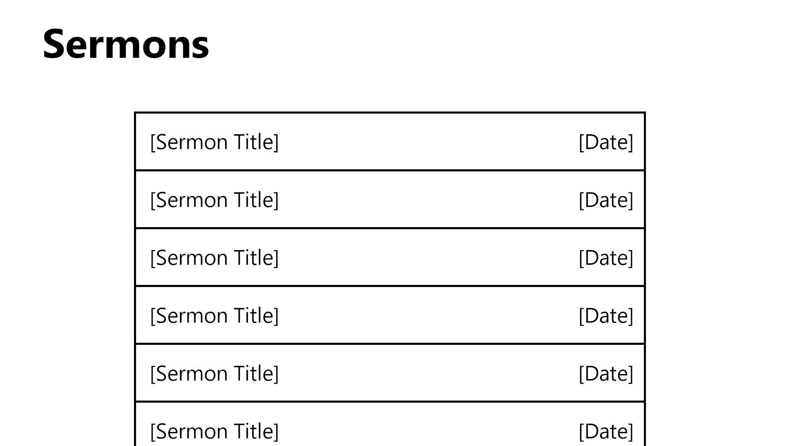

# CST-391 Milestone 6 - Presentation

**Eastern Ridge Church App**

- Author: Danielle DeSilvio
- Date: October 26, 2025

## Introduction

The Eastern Ridge Church is a hypothetical church aiming to provide its members a means of accessing the topical content and resources found within their sermons. Users of the application will be able to see sermon summaries, verses referenced, and the songs used in the worship service.

## Screencast

Click the following link to view the screencast presentation:

## NOTICE

The application shown in the screencast is identical to the one showcased in **Milestone 5**. Click [[here]](https://github.com/danielleds/cst391/tree/main/milestones/milestone5) to access the project files.

## TODO (Improvements/bug fixes)

- Styling of the home page to make it presentable.

## User Stories

| User Functionality | Admin Functionality |
| -------- | ------- |
| View Sermons  | Create Sermons    |
| View the verses and songs associated with sermons | Delete Sermons         | Edit Sermons      |
|               | Create Songs      |
|               | Edit Songs        |
|               | Delete Songs      |
|               | Create Verses     |
|               | Edit Verses       |
|               | Delete Verses     |

## API

| Request type | Endpoint | Description |
| -------- | ------- | ------- |
| GET | /sermons | Retrieves all sermons and their associated data. |
| GET | /sermons/{id} | Get a sermon by its id. **{id}**: the id of the sermon. |
| POST | /sermons | Creates a new sermon. Useable by administrators only. |
| PUT | /sermons | Update the specified sermon. Useable by administrators only. |
| DELETE | /sermons/{id} | Delete the specified sermon. Useable by administrators only. **{id}**: the id of the sermon. |
| GET | /verses | Retrieves all verses and their associated data. |
| GET | /verses/{id} | Get a verse by its id. **{id}**: the id of the verse. |
| POST | /verses | Creates a new verse. Useable by administrators only. |
| PUT | /verses | Update the specified verse. Useable by administrators only. |
| DELETE | /verse/{id} | Delete the specified verse. Useable by administrators only. **{id}**: the id of the verse. |
| GET | /songs | Retrieves all songs and their associated data. |
| GET | /songs/{id} | Get a song by its id. **{id}**: the id of the song. |
| POST | /songs | Creates a new song. Useable by administrators only. |
| PUT | /songs | Update the specified song. Useable by administrators only. |
| DELETE | /songs/{id} | Delete the specified song. Useable by administrators only. **{id}**: the id of the song. |

## Database ER Diagram

The ER Diagram for the church app. Songs and verses have two different types in the databases to provide a link between them and sermons, since MySQL does not have arrays. "sermonSongs" and "sermonVerses" have the id of both the sermon and the respective song/verse. When fetching sermons, the API will first search these two tables by the sermon ID, then fetch all of the songs/verses with the "songId" and "sermonId" properties.

## Sitemap

The sitemap for the church application. The home page will be accessible from any point on the site with a link in the header.

## UI Wireframes

The home/about page. This page will be scrollable to accommodate both the carousel and the introductory text.

The sermons list. Clicking on a listing will bring users to the respective sermon page.

The page for each sermon will be identical besides its content. The songs/verses list at the side are both dropdowns; both can be opened and closed independent of one another.

## UML

The UML Class Diagram. Unlike MySQL, TypeScript and JavaScript have arrays which are utilized so that songs and verses have a direct connection, which is used in the rendering of web pages.